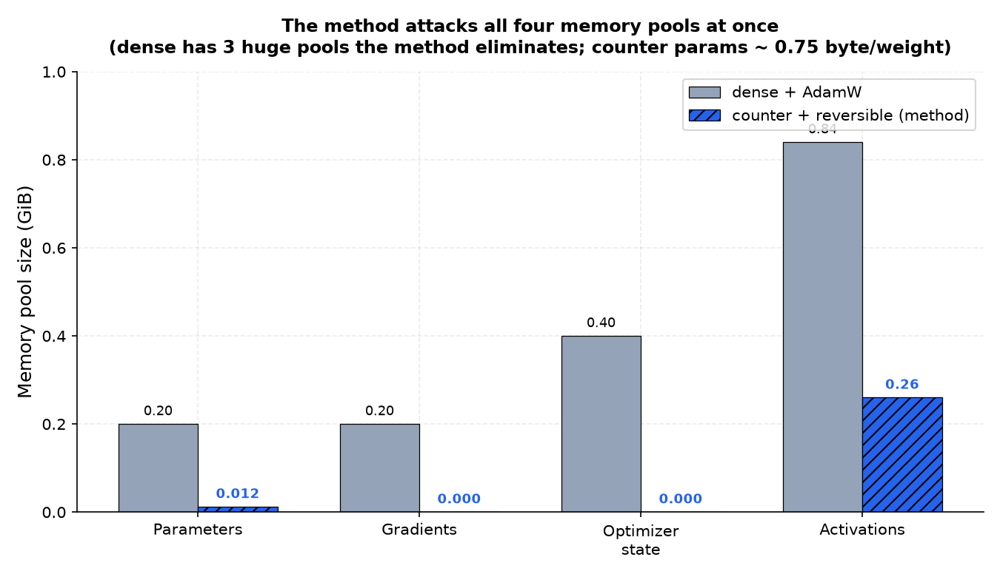
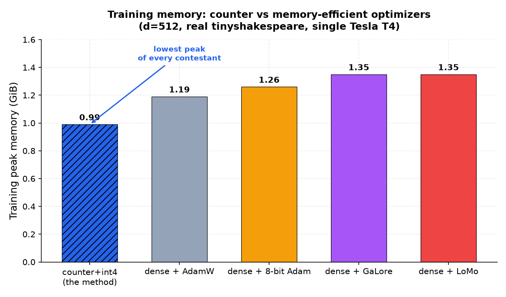
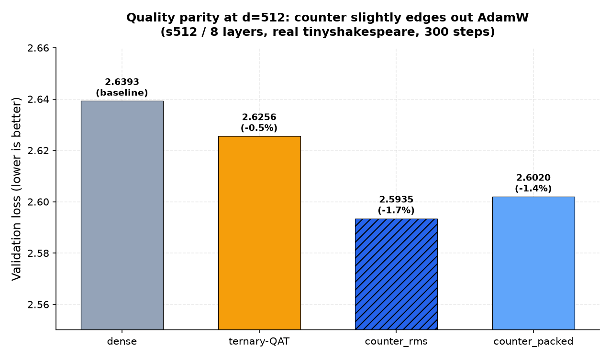
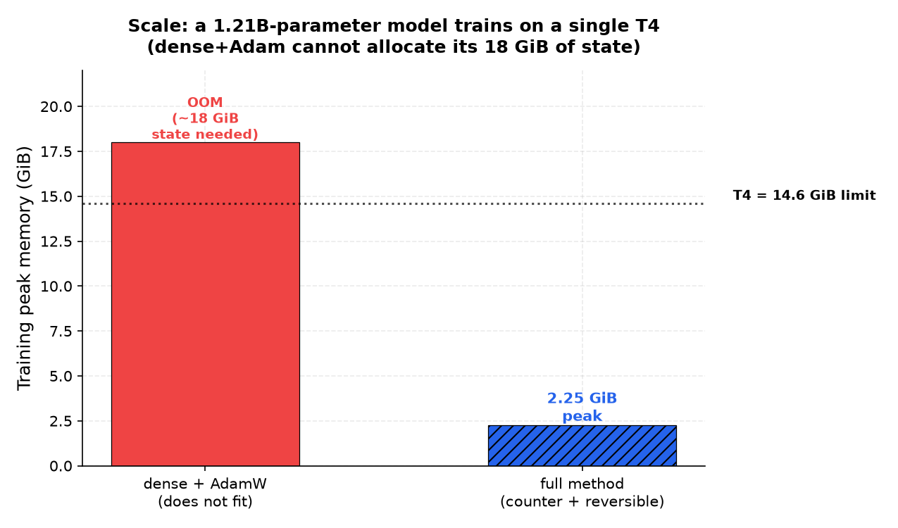
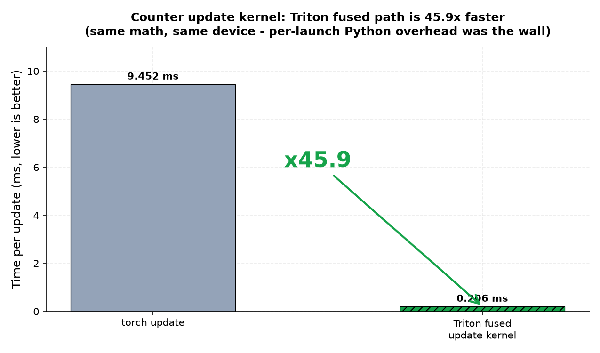

# Training Without Master Weights: a 6-bit Counter Synapse for Memory-Native Training

*A preprint draft and a working, GPU-validated implementation of a training method where the entire per-parameter optimizer state collapses into 6 bits.*

**Repo + preprint:** [github.com/kharkilirov1/memory-native](https://github.com/kharkilirov1/memory-native)

---

## The problem with "tiny" ternary models

Ternary networks — BitNet and its successors — look impossibly small at inference. Each weight is one of `{-1, 0, +1}`, so a 1.58-bit model ships in a fraction of the memory of its dense equivalent.

But during training, that same weight drags along an entire entourage:

- a full-precision **master weight** (the "real" number),
- **Adam's first moment** (running gradient mean),
- **Adam's second moment** (running gradient variance),
- and a **full gradient** retained in the buffer until the optimizer step.

That is roughly **16 bytes of training state per 1.58-bit inference weight**. The optimizer, not the weight, dominates training memory. Every "memory-efficient optimizer" you have heard of — 8-bit Adam, GaLore, Lomo — only shrinks one slice of this picture (the optimizer state). They leave the other three pools untouched.

The question I could not stop asking: **why is the optimizer a separate object from the weight at all?**

## The idea: collapse the optimizer *into* the weight

In `memory-native`, the entire per-parameter training state is a single **6-bit code**. There is no FP master weight. There are no Adam moments. There is no retained gradient buffer.

The code is two fields packed together:

```
σ = (t, c)
  t ∈ {-1, 0, +1}            visible ternary weight (used in the GEMM)
  c ∈ {-(C-1), …, +(C-1)}    bounded stochastic-rounding accumulator
```

With the default `C = 11`, that is `3 × 21 = 63` states — **6 bits** — and four of them pack into three bytes (0.75 B/parameter persistent). Per-row scale and RMS estimates are amortized to ~0 extra bits.

When a gradient arrives, it does not update a master weight. It updates the **accumulator `c`**. When `c` overflows a threshold, the ternary weight `t` flips. That is the entire update.

If you have seen a **sigma-delta ADC** or hardware **error feedback**, you have seen this mechanism. The accumulator is the integrator; the ternary weight is the quantizer; the residual that the quantizer "rounds off" is tracked exactly in `c` and fed back next step. The optimizer is a finite-state automaton, not a vector of floats.

## What it behaves like, in expectation

Here is the non-obvious part: this bounded, integer, 6-bit machine, when its gradient input is RMS-normalized first, implements — **in expectation** — RMS-normalized SGD on a latent weight, with the visible ternary weight as a quantized readout whose residual is tracked exactly in state.

So it is not a hack that happens to train. It is a proper optimizer wearing a discrete disguise. The bounded counter is the trick that lets it forget: if pressure against an already-saturated weight persists for too long, the residual saturates, and we trade a little information for a 16× smaller state. (More on that trade-off — and the open question it creates — at the end.)

## What it actually saves

The thesis of the method is that real training-memory savings only appear when you attack **all four** memory pools at once — parameters, gradients, optimizer state, and activations. The counter synapse kills the first three. The fourth needs a different lever.



The counter pool is ~0.75 byte/weight vs dense's ~16. The gradient buffer is gone (the update is fused into backward, one layer's `grad_w` live at a time). The optimizer state is zero — it *is* the parameter. The only pool left is activations, and there the method composes with a separate, well-known idea: **reversible coupling blocks**, which recompute activations in backward instead of storing them — making activation memory O(1) in depth, not O(L).

Stack the two levers and the training peak collapses.

## The result, on a real GPU

Everything below is from real runs on a single Kaggle Tesla T4 (torch 2.10 + triton 3.6). Raw logs are in the repo. Nothing is simulated.

### 1. Lowest training peak of every contestant

At d=512 on real tinyshakespeare, I benchmarked the full method against the memory-efficient optimizers people actually use:



The memory-efficient *optimizers* (8-bit Adam, GaLore, Lomo) barely beat plain AdamW — because at this scale the optimizer pool they shrink is a small slice of the peak. The counter attacks both the optimizer pool *and* activations, which is the only combination that moves the peak meaningfully.

### 2. Quality parity — and a slight win

Here is the part I expected to lose, and did not. At d=512, 300 steps:



Counter+RMS does not just track dense — it **edges it out** on validation loss (2.5935 vs 2.6393, −1.7%). I am not claiming this generalizes. I am claiming the method is not obviously throwing quality away to save memory, which is what you would have predicted from "6 bits of state per weight."

### 3. A billion parameters, one T4

The scale claim. Same full method (`ReversibleGPT`: counter linears + O(1) reversible sequence), **1.21B counter coefficients**, trained end-to-end on one 14.6 GiB T4:



Dense + AdamW needs ~18 GiB of state for a model this size and OOMs on this card. The full method peaks at **2.25 GiB** and trains. The point is not "T4 is fast" — the point is that the model *fits* there at all.

### 4. The engineering: a fused update kernel

A counter method lives or dies on its update path. In pure PyTorch, the per-element decode/update dominates:



A fused Triton kernel that does the decode + RMS update + counter transition in one launch is **45.9× faster** than the torch path. Same math, same device — the wall was per-launch Python overhead, exactly as a profiler would predict. There is also an int8 Tensor-Core forward (a derived visible-weight cache, so the GEMM runs on integer units instead of unpacking 6-bit) which is ×2.05 over the decode path on isolated shapes.

## What I am being honest about

This is a preprint draft (v0.1), not a finished paper. The single most important thing that is **not yet proven** is:

> **Convergence parity at 7B+ scale on real corpora.**

At d=512 and d=1024 on small data the method tracks or beats dense. I have not yet shown it holds when you scale both the model *and* the data. The preprint marks this explicitly as `OPEN`. I would rather publish that honestly than oversell a 1B-run that is barely one epoch on a small corpus.

There is also a specific mechanistic hypothesis I have about *why* the gap might appear at scale, and it is the next thing I want to test. It comes directly out of the bounded-counter design.

## The open question has a shape

The counter is bounded. That is not a bug — boundedness is what buys you 6 bits. But it means that when a weight is already saturated at `+1` and the gradient keeps pushing up, the residual accumulator saturates at `+(C-1)`, and the "excess pressure" each step is lost.

At small scale this almost never matters — gradients flip signs often enough that residuals clear. At large scale, with more weights and longer optimization horizons, **a growing fraction of the model may be sitting on the counter boundary, partially deaf to gradient pressure**. If that fraction grows with model width, that is your mechanism for a convergence gap.

The nice thing about this hypothesis is that it is **measurable**: instrument the counter layer to report what fraction of weights are saturated at each step, sweep model width, and see if the saturation rate climbs. That is the next experiment — it does not even need new training, just instrumenting existing witnesses. I have written it up as the follow-up.

## Why I built this

I am a self-taught researcher — no formal ML background, learned on hardware I got access to only recently. I built `memory-native` because I could not find a satisfying answer to the question "why is the optimizer a separate object from the weight?" The implementation is mine, the engineering is heavy on AI assistance (the Vulkan port of the engine this came from, and the Triton kernels, were largely written by frontier coding models under my direction), but the core question and the method that answers it are the point of this work.

I am publishing the preprint draft now, in this incomplete state, because:

1. The memory and scale results are real and worth scrutiny.
2. The open question is well-defined, and I would rather get feedback on it now than polish in private.
3. The method is simple enough that someone with more compute than I have could settle the convergence question faster than I can.

**Ruthless feedback welcome.** Especially from anyone who has looked at BitNet-style QAT, sigma-delta modulation, or memory-efficient training and can tell me either "this exists, here is the paper" or "this is novel, here is what you missed."

---

**Links:**
- **Repo, preprint, code, all raw T4 logs:** [github.com/kharkilirov1/memory-native](https://github.com/kharkilirov1/memory-native)
- **Preprint (v0.1 draft):** [`paper/MEMORY_NATIVE_PREPRINT.md`](https://github.com/kharkilirov1/memory-native/blob/main/paper/MEMORY_NATIVE_PREPRINT.md)
- **Release v0.1:** [github.com/kharkilirov1/memory-native/releases/tag/v0.1](https://github.com/kharkilirov1/memory-native/releases/tag/v0.1)
- **MIT licensed.** Pure PyTorch. `pip install -e .` and `pytest` (139 passed, 12 skipped on CUDA-only paths).
