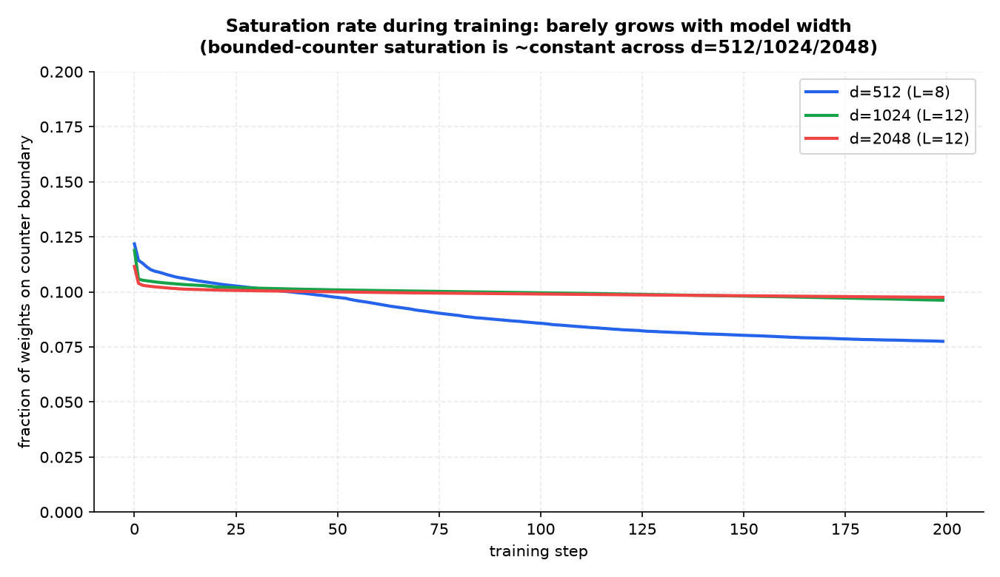
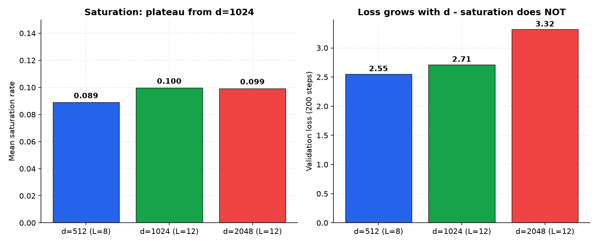

# Saturation analysis — why does convergence parity degrade at scale?

**Status:** empirical finding (negative on the original hypothesis, with a new hypothesis emerging). Kaggle kernel `lirovkharki/memory-native-saturation-vs-scale`, single Tesla T4, real tinyshakespeare, 200 steps per config. Raw data: `results/kaggle_saturation/`.

## The original hypothesis

> *The bounded counter loses gradient pressure when weights saturate against the +/-1 boundary. If the saturation rate grows with model width, that is a mechanistic explanation for the OPEN convergence gap at scale.*

Predicted: saturation rate climbs from d=512 → d=1024 → d=2048.

## What we measured

Per-step, per-counter-layer:
- **saturation rate**: fraction of weights whose accumulator `c` is at the boundary `+/-(C-1)` — "stuck against the wall"
- **blocked rate**: fraction of weights that are both ternary-saturated `|t|==1` AND counter-saturated (proposed flips blocked by the ternary ceiling)
- **flip rate**: fraction of weights whose ternary value actually changed this step
- **mean |c|**: how full the accumulator is on average

Three ReversibleGPT runs, identical except for `d`:

| config | layers | counter layers | mean sat | mean blocked | **mean flip** | val loss | peak |
|---|---|---|---|---|---|---|---|
| d=512, L=8 | 8 | 48 | 8.90% | 0.49% | **4.06%** | 2.55 | 0.14 GiB |
| d=1024, L=12 | 12 | 72 | 9.98% | 0.40% | **1.19%** | 2.71 | 0.33 GiB |
| d=2048, L=12 | 12 | 72 | 9.93% | 0.43% | **1.02%** | 3.32 | 0.89 GiB |



## Result 1: the original hypothesis is REFUTED

Saturation does **not** grow with scale. It rises one percentage point from d=512 to d=1024 and then **plateaus** at ~10%. d=2048 is *slightly lower* than d=1024. If saturation were the mechanism, d=2048 should be much worse — it is not.

The bounded counter is not the bottleneck at scale.

## Result 2: a new finding — flip rate collapses with width

This is the unexpected signal. **Flip rate falls 4×** from d=512 to d=1024, and keeps dropping:

| config | mean flip rate |
|---|---|
| d=512 | **4.06%** |
| d=1024 | **1.19%** (3.4× lower) |
| d=2048 | **1.02%** (continues down) |

At fixed `lr_scale=2e-4`, larger models update their ternary weights far less often. Combined with `val loss climbing` (2.55 → 2.71 → 3.32 at fixed 200 steps), the picture is:

> **At scale, the counter update signal becomes too small to cross the flip threshold, so larger models physically update less per step, and learn slower.**

## Result 3: this is not saturation hiding flips

Saturation is ~10% in all three configs — so the loss of flips is not because weights are stuck at the boundary. The counter is well within its range; the gradient pressure just is not large enough to push `c` over the rounding threshold as `d` grows.

The mechanistic reason is in the math. The effective update to `c` is:

```
ticks = (-lr * grad_eff) * (C / s_new)
```

where `grad_eff = grad_w / sqrt(v_row)` is the RMS-normalized gradient. As `d` grows:
- `grad_w` magnitude drops (the row-sum of `grad_out × x` shrinks because `x` is normalised to unit-ish by LayerNorm across a wider dim),
- `sqrt(v_row)` tracks the squared gradient, also shrinking — but not enough,
- net: `|ticks|` drops, fewer ticks cross `|c| + ticks ≥ C`, fewer flips.

`lr_scale=2e-4` was tuned at small `d`. It does not transfer to large `d` for free.



## New hypothesis (testable)

> **`lr_scale` must scale up with model width to keep the flip rate constant.** If the flip rate at d=512 with `lr_scale=2e-4` is the "right" rate, then d=2048 needs a larger `lr_scale` to reach the same rate. If so, val loss at d=2048 with the corrected `lr_scale` should match d=512 — and the "convergence gap" is not a gap at all, it is an untuned hyperparameter.

### Falsifying experiment (next kernel)

Fix `d=2048`. Sweep `lr_scale ∈ {2e-4, 4e-4, 8e-4, 1.2e-3, 2e-3}`. Measure flip rate and val loss at 200 steps. Predict:

- **If hypothesis holds:** flip rate climbs back toward ~4% as `lr_scale` grows; val loss drops toward ~2.6-2.7.
- **If hypothesis fails:** flip rate climbs but val loss does not improve (some other bottleneck — variance from stochastic rounding at scale, or a representation problem).

This is a one-T4, ~3-hour experiment with a clean binary outcome.

## Implications for the preprint

This finding **narrows the OPEN question**. The original framing — "convergence parity at scale is open" — had a long list of candidate explanations. After this experiment:

- ✗ **Bounded counter saturation** — refuted (this analysis)
- ? **`lr_scale` mis-tuned for width** — falsifiable next; predicted as likely cause
- ? **Stochastic-rounding variance at scale** — open; orthogonal to lr_scale
- ? **Representation capacity of ternary weights at width** — open; would persist even with corrected lr_scale

Whatever the next experiment finds, this is real progress: an OPEN question turned into a **specific, measurable hypothesis** with a predicted outcome.

## Reproduce

```bash
# Kernel source:
#   fog-transformer/kaggle/kaggle_mn_saturation_scale/mn_saturation_scale_kaggle.py
# Push to Kaggle:
#   kaggle kernels push -p fog-transformer/kaggle/kaggle_mn_saturation_scale
# Pull outputs after run completes:
#   kaggle kernels output lirovkharki/memory-native-saturation-vs-scale -p results/kaggle_saturation/

# Rebuild charts locally:
.venv/Scripts/python scripts/make_saturation_charts.py results/kaggle_saturation/
```

Raw per-step data: `results/kaggle_saturation/saturation_<tag>.json`.

---

# Follow-up: lr_scale sweep (d=2048) — second hypothesis refuted

After the saturation analysis, a follow-up kernel (`lirovkharki/memory-native-lr-scale-sweep-d2048`) tested the new hypothesis that `lr_scale=2e-4` was mis-tuned at large `d`. **Result: refuted.** Raw data: `results/kaggle_lrscale/`.

## Bug found in the probe (during analysis)

The probe initially reported `flip_rate` from `weight_flips` (the buffer incremented in `RMSCounterLinear._update_tile`). On the T4 this buffer is **never incremented**, because the fused Triton kernel (`fused_update.py`) writes the packed state directly and skips `_write_rows` / the `weight_flips.add_()` call. The metric `flip_rate` (buffer-based) returned 0.0 for every step on every config.

The accurate metric is `flip_rate_alt`, computed by comparing the decoded ternary `t` before and after each step. All numbers below use `flip_rate_alt` over the stationary regime (steps 50-200), dropping the initialization burst in the first ~50 steps where nearly every weight flips once.

## Re-analyzed scale-sweep numbers (correct metric)

| config | stationary flip rate (steps 50-200) | val loss |
|---|---|---|
| d=512  | **4.17%** | 2.55 |
| d=1024 | **0.78%** | 2.71 |
| d=2048 | **0.57%** | 3.32 |

The flip-rate collapse with width is real and large (4.17% → 0.57% is a 7× drop), larger than the initial analysis showed.

## lr_scale sweep at d=2048

Fixed `d=2048, L=12, steps=200`, swept `lr_scale` over a 10× range. Raw data: `results/kaggle_lrscale/`.

| lr_scale | stationary flip rate | val loss |
|---|---|---|
| 2e-4  | 0.56% | 3.32 |
| 4e-4  | 0.56% | 3.32 |
| 8e-4  | 0.56% | 3.32 |
| 1.2e-3 | 0.56% | 3.31 |
| 2e-3 | 0.56% | 3.31 |

**10× change in `lr_scale` moves neither flip rate nor val loss.** The hypothesis is refuted.

## Why the hypothesis was wrong: parameter confusion

The follow-up was launched on a misread of the counter update math. In `_update_tile`:

```python
s_new = (s_i - self.lr_scale * grad_s).clamp_(1e-5, 10.0)      # lr_scale -> per-row scale
ticks = (-self._eff_lr() * update_signal) * (self.C / s_new)   # _eff_lr = self.lr * _lr_mult
```

`lr_scale` controls the learning rate of the **per-row scale `s`**, not the counter ticks. The counter `c` is driven by `self.lr` (default `3e-3`). Sweeping `lr_scale` cannot move the flip rate by construction. Correcting the hypothesis means sweeping `lr`, not `lr_scale`.

## Side finding: lr_scale is inert

The 10× sweep that does nothing is itself a finding: the per-row scale dynamics are very weakly coupled to `lr_scale` over 200 steps. The scale moves slowly under gradient pressure regardless of `lr_scale`, because `grad_s` is a row-sum (low magnitude) and `clamp_(1e-5, 10.0)` caps excursions. This is a stability property, not a bug.

## Next experiment (corrected)

Fix `d=2048`. Sweep `lr` (the counter learning rate, default `3e-3`) over `{3e-3, 6e-3, 1e-2, 2e-2}`. Predict: if `|ticks| ~ lr * grad_eff` and `grad_eff` shrinks as `1/sqrt(d)` with LayerNorm, then doubling `lr` at d=2048 should approximately recover the d=512 flip rate (~4%) and bring val loss back toward ~2.6.

If `lr` also fails to move flip rate, the bottleneck is upstream of the counter (gradient magnitude at the layer input, scale of `grad_out`), and the search moves to normalization or initialization.

