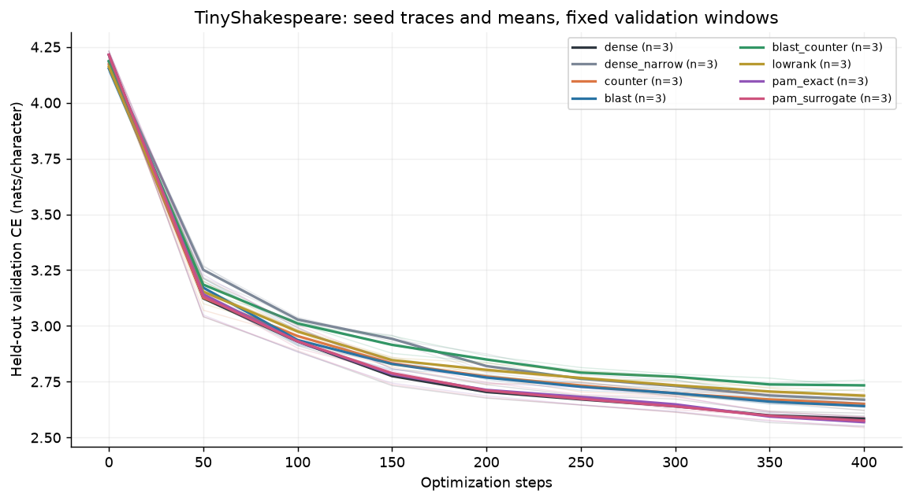
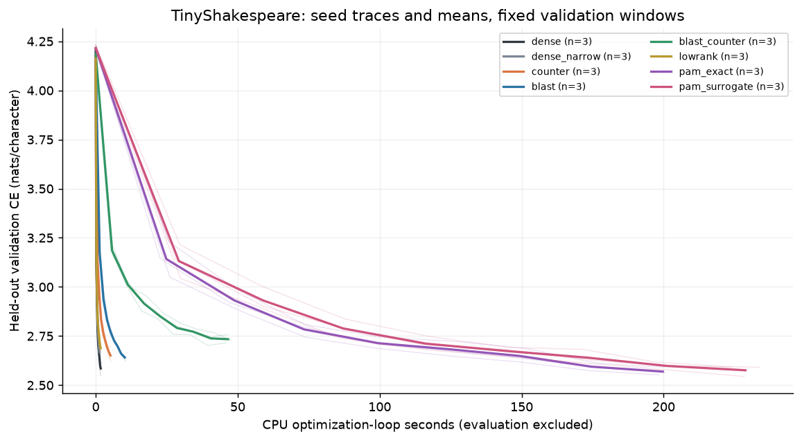
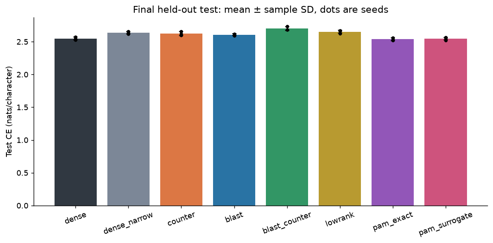
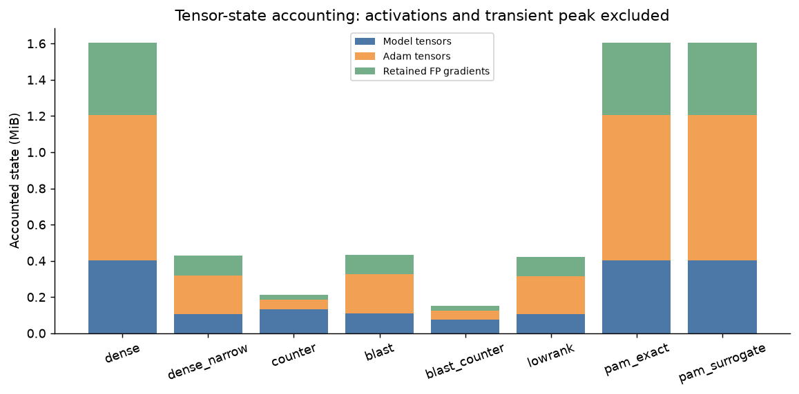
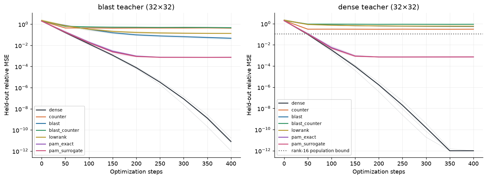

# Structured counter and PAM CPU experiment

Generated from the raw JSON records indexed in [SUMMARY.json](SUMMARY.json). Reported ± values are sample standard deviations across seeds; they are not confidence intervals.

`manifest_main.json`: 24/24 runs, complete.

`manifest_regression.json`: 42/42 runs, complete.

Corpus: TinyShakespeare, 1,115,394 characters, 65 character vocabulary; chronological 80/10/10 split ([892315, 111539, 111540]). Corpus SHA-256: `86c4e6aa9db7c042ec79f339dcb96d42b0075e16b8fc2e86bf0ca57e2dc565ed`.

Primary budget: 400 steps, batch 4 × context 32, 2 blocks, width 64 (dense_narrow: 32), 4 heads, 1 CPU thread(s). Seeds: `[0, 1, 2]`. Fixed validation/test windows are identified by hashes in SUMMARY.json.

The harness selects each body LR on validation with a separate seed-90 tuning stage; the actual tuning budgets and selected-LR files are retained in provenance when supplied. The FP shell uses LR 0.003, and test windows are evaluated once at the end of each primary run. No gradient clipping, dropout, teacher distillation or activation checkpointing is used in the LM pilot.

Runtime: Python 3.12.14, PyTorch 2.14.1+cpu, NumPy 2.5.3; CPU reference implementation.

Verified corpus bytes match the [Karpathy TinyShakespeare source](https://raw.githubusercontent.com/karpathy/char-rnn/master/data/tinyshakespeare/input.txt) downloaded for this study; the SHA-256 pins the content independently of the live URL.

Recorded tuning budget(s): `[100]` steps per body LR, seed 90; validation selects the LR and test CE is not used for selection.

## Held-out character-model results

| Variant | Seeds | Body LR | Test CE, nats/char | Test PPL | Body coefficients | Accounted state, MiB | Training tok/s |
|---|---:|---|---:|---:|---:|---:|---:|
| dense | 3 | 0.001 | 2.5489 ± 0.0233 | 12.80 ± 0.30 | 98,304 | 1.605 ± 0.000 | 29147 ± 2826 |
| dense_narrow | 3 | 0.003 | 2.6352 ± 0.0185 | 13.95 ± 0.26 | 24,576 | 0.427 ± 0.000 | 37902 ± 2012 |
| counter | 3 | 0.01 | 2.6245 ± 0.0306 | 13.80 ± 0.42 | 98,304 | 0.211 ± 0.000 | 9842 ± 461 |
| blast | 3 | 0.001 | 2.6068 ± 0.0150 | 13.56 ± 0.20 | 21,504 | 0.434 ± 0.000 | 5014 ± 260 |
| blast_counter | 3 | 0.01 | 2.7009 ± 0.0293 | 14.90 ± 0.44 | 21,504 | 0.152 ± 0.000 | 1099 ± 20 |
| lowrank | 3 | 0.001 | 2.6523 ± 0.0238 | 14.19 ± 0.34 | 20,736 | 0.421 ± 0.000 | 29804 ± 563 |
| pam_exact | 3 | 0.001 | 2.5373 ± 0.0224 | 12.65 ± 0.28 | 98,304 | 1.605 ± 0.000 | 256 ± 2 |
| pam_surrogate | 3 | 0.001 | 2.5462 ± 0.0226 | 12.76 ± 0.29 | 98,304 | 1.605 ± 0.000 | 224 ± 5 |

PPL is exp(CE) within each seed; mean PPL is not exp(mean CE). Each variant has a different initial operator except the matched dense/PAM weights. Matching the random seed does not make operator families identical at initialization.

### Paired differences from dense

Negative CE differences favor the variant. Pairing uses the same primary seed and held-out windows; only seeds available for both variants enter each row. Three seeds cannot establish robust significance or long-run convergence parity.

| Variant | Paired seeds | Test CE difference, mean ± SD | Per-seed CE differences |
|---|---:|---:|---|
| dense_narrow | 3 | 0.0862 ± 0.0219 | s0: +0.0898; s1: +0.1061; s2: +0.0628 |
| counter | 3 | 0.0756 ± 0.0086 | s0: +0.0723; s1: +0.0691; s2: +0.0853 |
| blast | 3 | 0.0579 ± 0.0109 | s0: +0.0634; s1: +0.0649; s2: +0.0453 |
| blast_counter | 3 | 0.1519 ± 0.0501 | s0: +0.2082; s1: +0.1353; s2: +0.1123 |
| lowrank | 3 | 0.1034 ± 0.0337 | s0: +0.1415; s1: +0.0777; s2: +0.0910 |
| pam_exact | 3 | -0.0116 ± 0.0041 | s0: -0.0079; s1: -0.0161; s2: -0.0109 |
| pam_surrogate | 3 | -0.0027 ± 0.0063 | s0: -0.0052; s1: +0.0044; s2: -0.0074 |

### State components

These are tensor bytes after training: model buffers/parameters, Adam state and retained FP parameter gradients. Their sum excludes activations, decoded factor weights, factor intermediates, temporary correlation/gradient buffers, Python/runtime overhead and allocator behavior. **Training peak memory was not measured.** Counter codes here are uint8, not six-bit packed. PAM keeps full FP weights and Adam state; changing the product does not compress them.

| Variant | Model, MiB | Adam, MiB | FP gradients, MiB | Body forward pair products/step |
|---|---:|---:|---:|---:|
| dense | 0.401 ± 0.000 | 0.802 ± 0.000 | 0.401 ± 0.000 | 12,582,912 |
| dense_narrow | 0.107 ± 0.000 | 0.214 ± 0.000 | 0.107 ± 0.000 | 3,145,728 |
| counter | 0.133 ± 0.000 | 0.052 ± 0.000 | 0.026 ± 0.000 | 12,582,912 |
| blast | 0.109 ± 0.000 | 0.217 ± 0.000 | 0.108 ± 0.000 | 2,752,512 |
| blast_counter | 0.073 ± 0.000 | 0.052 ± 0.000 | 0.026 ± 0.000 | 2,752,512 |
| lowrank | 0.105 ± 0.000 | 0.211 ± 0.000 | 0.105 ± 0.000 | 2,654,208 |
| pam_exact | 0.401 ± 0.000 | 0.802 ± 0.000 | 0.401 ± 0.000 | 12,582,912 |
| pam_surrogate | 0.401 ± 0.000 | 0.802 ± 0.000 | 0.401 ± 0.000 | 12,582,912 |

Pair-product counts are arithmetic accounting, not measured FLOPs or execution speed. Exact PAM backward evaluates slopes and exponent shifts, while surrogate PAM backward uses PAM products; three pair evaluations do not mean three ordinary MACs or three PAM products. The raw forward/backward kinds are preserved in SUMMARY.json. BLAST applies U/V/S factors directly without reconstructing full W; factor intermediate tensors still exist. Its p=16, rank=8 square-layer global rank is bounded by d/2, even though individual blocks use shared rank-8 factors. Rectangular layers have the corresponding input/output block bottleneck. The dense_narrow control reduces the complete model width rather than imposing this factorization. The lowrank arm approximates the BLAST coefficient budget with a lower plain matrix rank. Actual body coefficients and rank bounds are preserved in SUMMARY.json. Attention, head, norms, loss and optimizer remain ordinary PyTorch arithmetic; PAM changes only body-linear pair products.

Measured coefficient budgets: BLAST 21,504; lowrank 20,736 (-3.57%). Recorded body rank-bound values: BLAST `[32]`; lowrank `[9]`.









## Two-teacher regression control

Independent 32×32 teacher regression with 1536 training and 512 held-out Gaussian examples. Teachers and samples are shared across variants. This uses an independent fixed regression LR recipe, not the LM-selected LRs, so it does not isolate only architecture capacity.

| Teacher | Variant | Seeds | Final relative MSE, mean ± SD | Training seconds |
|---|---|---:|---:|---:|
| blast | dense | 3 | 0.00000 ± 0.00000 | 0.13 ± 0.00 |
| blast | counter | 3 | 0.41893 ± 0.00313 | 0.28 ± 0.09 |
| blast | blast | 3 | 0.04608 ± 0.01086 | 0.55 ± 0.06 |
| blast | blast_counter | 3 | 0.46459 ± 0.04868 | 2.66 ± 0.23 |
| blast | lowrank | 3 | 0.13405 ± 0.00629 | 0.17 ± 0.01 |
| blast | pam_exact | 3 | 0.00074 ± 0.00001 | 0.89 ± 0.05 |
| blast | pam_surrogate | 3 | 0.00074 ± 0.00001 | 0.93 ± 0.03 |
| dense | dense | 3 | 0.00000 ± 0.00000 | 0.12 ± 0.00 |
| dense | counter | 3 | 0.30394 ± 0.00455 | 0.26 ± 0.01 |
| dense | blast | 3 | 0.54603 ± 0.00850 | 0.39 ± 0.06 |
| dense | blast_counter | 3 | 0.88361 ± 0.03225 | 1.79 ± 0.05 |
| dense | lowrank | 3 | 0.58487 ± 0.00789 | 0.15 ± 0.01 |
| dense | pam_exact | 3 | 0.00073 ± 0.00000 | 0.81 ± 0.07 |
| dense | pam_surrogate | 3 | 0.00073 ± 0.00001 | 0.87 ± 0.08 |

The dense teacher includes components outside the BLAST rank-16 bottleneck. The SVD line is a population relative-MSE lower bound for unrestricted rank-16 linear regression under isotropic Gaussian inputs, not a finite held-out-sample guarantee. The BLAST teacher is representable by floating-point BLAST; ternary counter factors impose additional restrictions and are not guaranteed to represent the same target exactly. Final MSE reflects optimization and state dynamics as well as model capacity. The log-scale figure clips values below 1e-12 for display; raw values remain in SUMMARY.json.



## What this experiment establishes

The tables are small controlled CPU pilots of these implemented operators and training recipes. They do not establish LLM/pretraining convergence, donor-quality retention, GPU throughput, energy savings or production memory fit. The primary families ran as concurrent single-thread processes on separate pinned CPU cores sharing a host/cgroup quota; wall timings can include contention. CPU timing depends on this Python/PyTorch implementation and sequential many-small-matmul/frexp/ldexp reference paths; it is not hardware performance proof. Timings exclude setup, sampling, evaluation and I/O. Recorded seeds and a fixed held-out slice do not capture dataset or hardware uncertainty.

BLAST and PAM are prior art: [BLAST, arXiv:2410.21262](https://arxiv.org/abs/2410.21262) and [Multiplication-Free Transformer Training via Piecewise Affine Operations, arXiv:2305.17190](https://arxiv.org/abs/2305.17190). The new experiment here combines BLAST factors with memory-native counter updates and compares exact versus surrogate PAM backward. It does not claim invention of either operator.

## Reproduction

These commands are reconstructed from recorded manifest arguments; they are not an independently verified capture of the original shell command. Run the tuning stage first in the same output directory so selected_lrs.json exists, and preserve its raw records. Corpus bytes must match the recorded SHA-256. Source JSON SHA-256 values and manifest contents are retained in SUMMARY.json.

```bash
python scripts/new_math_experiments.py --data /workspace/memory-native-review/tinyshakespeare.txt --output /workspace/memory-native-review/results/new_math/exact --mode tune --variants pam_exact --seeds 0 1 2 --steps 400 --tune-steps 100 --regression-steps 400 --dim 64 --layers 2 --heads 4 --context 32 --batch 4 --block-size 16 --rank 8 --eval-batches 16 --eval-every 50 --threads 1
python scripts/new_math_experiments.py --data /workspace/memory-native-review/tinyshakespeare.txt --output /workspace/memory-native-review/results/new_math/fast --mode tune --variants dense dense_narrow counter blast blast_counter lowrank --seeds 0 1 2 --steps 400 --tune-steps 100 --regression-steps 400 --dim 64 --layers 2 --heads 4 --context 32 --batch 4 --block-size 16 --rank 8 --eval-batches 16 --eval-every 50 --threads 1
python scripts/new_math_experiments.py --data /workspace/memory-native-review/tinyshakespeare.txt --output /workspace/memory-native-review/results/new_math/surrogate --mode tune --variants pam_surrogate --seeds 0 1 2 --steps 400 --tune-steps 100 --regression-steps 400 --dim 64 --layers 2 --heads 4 --context 32 --batch 4 --block-size 16 --rank 8 --eval-batches 16 --eval-every 50 --threads 1
python scripts/new_math_experiments.py --data /workspace/memory-native-review/tinyshakespeare.txt --output /workspace/memory-native-review/results/new_math/exact --mode main --variants pam_exact --seeds 0 1 2 --steps 400 --tune-steps 100 --regression-steps 400 --dim 64 --layers 2 --heads 4 --context 32 --batch 4 --block-size 16 --rank 8 --eval-batches 16 --eval-every 50 --threads 1
python scripts/new_math_experiments.py --data /workspace/memory-native-review/tinyshakespeare.txt --output /workspace/memory-native-review/results/new_math/fast --mode main --variants dense dense_narrow counter blast blast_counter lowrank --seeds 0 1 2 --steps 400 --tune-steps 100 --regression-steps 400 --dim 64 --layers 2 --heads 4 --context 32 --batch 4 --block-size 16 --rank 8 --eval-batches 16 --eval-every 50 --threads 1
python scripts/new_math_experiments.py --data /workspace/memory-native-review/tinyshakespeare.txt --output /workspace/memory-native-review/results/new_math/surrogate --mode main --variants pam_surrogate --seeds 0 1 2 --steps 400 --tune-steps 100 --regression-steps 400 --dim 64 --layers 2 --heads 4 --context 32 --batch 4 --block-size 16 --rank 8 --eval-batches 16 --eval-every 50 --threads 1
python scripts/new_math_experiments.py --data tinyshakespeare.txt --output results/new_math/regression --mode regression --variants dense dense_narrow counter blast blast_counter lowrank pam_exact pam_surrogate --seeds 0 1 2 --steps 400 --tune-steps 100 --regression-steps 400 --dim 64 --layers 2 --heads 4 --context 32 --batch 4 --block-size 16 --rank 8 --eval-batches 16 --eval-every 50 --threads 1
python scripts/summarize_new_math.py --input results/new_math --output results/new_math
```

Plots are available as both PNG and SVG. No unpublished GPU result or missing historical artifact has been filled in by this report.
